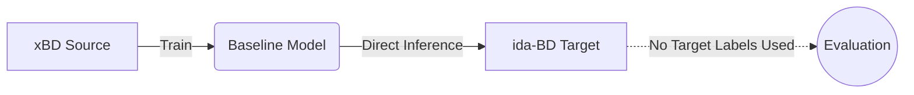
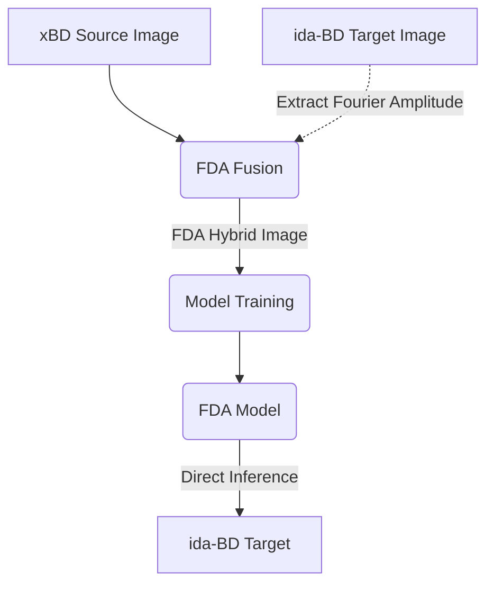
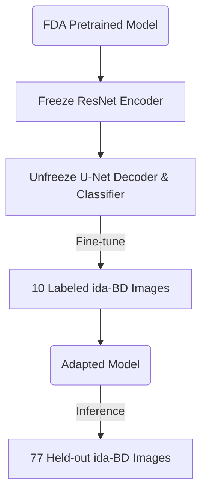

# Building Damage Assessment - Cross-Domain Generalization

**Topic**: Evaluating and improving cross-domain generalization capabilities using multi-resolution satellite imagery for building damage assessment.

## 1. Overview

This repository contains the source code and experimental results for the thesis.

**Main objectives**:
- Train a baseline model on the standard xBD dataset.
- Measure the Domain Shift Gap when the model evaluates on different geographical regions or lower resolution satellite imagery (ida-BD, xBD-S12).
- Experiment on a Vietnam Case Study (using Copernicus EMS data for floods) to evaluate real-world applicability in Vietnam.
- Apply preprocessing and adaptation methods (Domain Adaptation, Fine-tuning, Super-Resolution) to improve performance.

### Baseline Architecture

The current baseline model is:
- **Architecture**: Siamese U-Net with a ResNet-34 encoder.
- **Input**: Bi-temporal (Pre-disaster and Post-disaster images).
- **Training**: Trained for 50 epochs on the xBD dataset.

The model performs two related tasks:
1. **Building Localization**
2. **Building Damage Classification** (No Damage, Minor Damage, Major Damage, Destroyed)

---

## 2. Experimental Protocol & Concepts

The experiments in this project include several cross-domain evaluation and adaptation settings. It is important to distinguish between pure Domain Generalization and Domain Adaptation.

### 2.1 Workflow Visualizations

To intuitively understand the data flow of the key experiments without looking at the code, refer to the architectures below:

**1. Zero-Shot Cross-Domain (Domain Generalization)**


**2. FDA Augmentation (Unsupervised Domain Adaptation)**


**3. Hybrid FDA + Fine-Tuning (Few-Shot Adaptation)**


### 2.2 Adaptation Methods Explained

For adaptation experiments on `ida-BD` (which contains 87 image pairs), we split the data into 10 labeled images (for few-shot adaptation) and 77 held-out test images.

- **Unsupervised Domain Adaptation (UDA)**
  - **FDA Augmentation**: As shown above, the amplitude spectrum from unlabeled target images is swapped into source images during training. The model learns to be invariant to the target domain's style.
  - **Pseudo-Labeling (Self-Training)**: The baseline model generates artificial labels for unlabeled target-domain samples, and the model is retrained using these predictions.
  
- **Test-Time Preprocessing & Adaptation**
  - **FDA Inference**: Applies Fourier transformation during the testing stage to adjust the target image toward the source appearance before feeding it to the frozen baseline model.
  - **TENT (Test-Time Entropy Minimization)**: Adapts selected model parameters (Batch Normalization affine parameters) during inference by minimizing the entropy of the predictions on the target test data.
  - **AdaBN (Adaptive Batch Normalization)**: Updates Batch Normalization running statistics (mean and variance) using the target-domain image distribution before making predictions. No labels or gradient updates are required.
  - **TTA x4 (Test-Time Augmentation)**: Runs inference on multiple augmented views (original, horizontal flip, vertical flip, both) of each test image and averages the predictions. This does not update model parameters.

- **Supervised Domain Adaptation (Few-Shot)**
  - **Linear Probing**: Freezes the pretrained feature extractor (Encoder) and trains only the final prediction layers using a small amount of labeled target-domain data.

---

## 3. Evaluation Metrics

The project uses the official xView2 evaluation metrics, evaluating localization and damage classification separately.

- **True Positive (TP)**: Correctly predicted class.
- **False Positive (FP)**: Incorrectly predicted class (background predicted as building).
- **False Negative (FN)**: Missed ground truth (building predicted as background).

### Localization F1 ($F1_{Loc}$)
Measures the ability to identify building regions (binary classification: Building vs. Background).

$$F1_{Loc} = \frac{2TP_{Loc}}{2TP_{Loc} + FP_{Loc} + FN_{Loc}}$$

### Damage Classification F1 ($F1_{Dmg}$)
Calculated using the harmonic mean of the F1 scores for all four individual damage categories. The harmonic mean strongly penalizes poor performance in any single category (e.g., rare classes like "Destroyed").

$$F1_{Dmg} = \frac{4}{\frac{1}{F1_{NoDamage}} + \frac{1}{F1_{Minor}} + \frac{1}{F1_{Major}} + \frac{1}{F1_{Destroyed}}}$$

### xView2 Score
Combines localization (30% weight) and damage classification (70% weight). Damage classification is weighted higher as it is the primary objective of the assessment task.

$$Score_{xView2} = 0.3 \times F1_{Loc} + 0.7 \times F1_{Dmg}$$

---

## 4. Current Experimental Results

### 4.1 Evaluation Table

| Dataset | Evaluation Type | Experimental Setting | F1 Loc | F1 Dmg | xView2 Score |
|---|---|---|---:|---:|---:|
| **xBD (Test split)** | In-distribution | Baseline | **0.8509** | **0.7376** | **0.7716** |
| **ida-BD** | Zero-shot (Baseline) | Pure Zero-Shot OOD | 0.6853 | 0.1717 | 0.3258 |
| ida-BD | Zero-shot (FDA Inference) | Test-Time FDA Preprocessing | 0.6647 | 0.1598 | 0.3112 |
| ida-BD | Zero-shot (FDA Aug) | UDA - Unsupervised Domain Adaptation | 0.7424 | **0.2506** | **0.3982** |
| ida-BD (77 imgs) | Few-Shot 5% (Linear Probing) | Few-Shot Supervised Adaptation | 0.6904 | 0.1695 | 0.3258 |
| ida-BD (77 imgs) | Few-Shot 10% (Linear Probing) | Few-Shot Supervised Adaptation | 0.6904 | 0.1707 | 0.3266 |
| ida-BD (77 imgs) | Hybrid FDA+FT 10% (Encoder Frozen) | UDA + Few-Shot Fine-Tuning | **0.7527** | 0.2042 | 0.3687 |
| ida-BD (77 imgs) | Pseudo-Labeling (Self-Training) | UDA / Self-Training | 0.2805 | 0.0009 | 0.0848 |
| ida-BD | TENT Test-Time Adaptation | Test-Time Adaptation (lr=1e-5) | 0.6847 | 0.1790 | 0.3307 |
| ida-BD | AdaBN (Baseline model) | Test-Time BN Adaptation | 0.4581 | 0.1300 | 0.2284 |
| ida-BD | AdaBN (FDA Aug model) | UDA + Test-Time BN Adaptation | 0.7298 | 0.2452 | 0.3906 |
| ida-BD | TTA x4 (FDA Aug model) | UDA + Test-Time Augmentation | 0.7491 | 0.2458 | 0.3968 |
| **xBD-S12 (100 imgs)**| Zero-shot (cv2.resize) | Cross-Sensor Zero-Shot | 0.0000 | 0.0000 | 0.0000 |
| xBD-S12 (100 imgs)| Zero-shot (LapSRN x8) | Cross-Sensor + Super-Resolution | 0.0000 | 0.0000 | 0.0000 |
| **Vietnam Floods** | Zero-shot | External Real-World Case Study | (Not evaluated) | (Not evaluated) | (Not evaluated) |

### 4.2 Analysis & Observations

1. **Large Cross-Domain Generalization Gap**: Direct transfer from xBD to ida-BD causes a significant drop, especially in damage classification ($Gap_{Dmg} = 0.5659$) compared to localization ($Gap_{Loc} = 0.1656$). Building geometry is relatively transferable, but damage appearance is highly domain-sensitive.
2. **Target-Domain Style Adaptation is Highly Effective**: FDA Augmentation during training provides the strongest improvement ($+45.95\%$ relative improvement in Damage F1 over baseline). Exposing the model to target-domain frequency statistics during training is far more robust than attempting to align domains during inference.
3. **Test-Time Constraints**: Methods that adjust network parameters (TENT) or statistics (AdaBN on Baseline) struggle due to the small size of the target test set. However, AdaBN applied to a model already aligned to the target domain (FDA Aug) remains stable.

---

## 5. Environment Setup

Activate the Conda environment:
```bash
conda activate xbd_env
```

Install dependencies if not already installed:
```bash
pip install -r requirements.txt
```

## 6. Running Experiments

Evaluate on xBD Test set:
```bash
python src/evaluate.py --config configs/baseline.yaml --checkpoint experiments/baseline_resnet34/checkpoints/best_model.pth --split test
```

Zero-shot evaluation on ida-BD:
```bash
python src/eval_ida.py --checkpoint experiments/baseline_resnet34/checkpoints/best_model.pth
```

Train model from scratch:
```bash
python src/train.py --config configs/baseline.yaml
```

Monitor training progress:
```bash
tensorboard --logdir experiments/baseline_resnet34/logs
```

## 7. Data Structure

- Note: The `data/` directory is not pushed to GitHub and will be synced via Google Drive.
- `data/xBD/`: Original dataset, containing train/tier3/test splits.
- `data/ida-BD/`: Hurricane Ida dataset.
- `data/Vietnam-Floods/`: Satellite imagery from Copernicus EMS (to be added in Phase 3).

## 8. Web Application (Demo)

The model is integrated with a Web UI for visual classification results.

Start the backend server:
```bash
cd webapp/backend
python -m uvicorn app:app --host 0.0.0.0 --port 8000 --reload
```
Access `http://localhost:8000` to view the demo.
